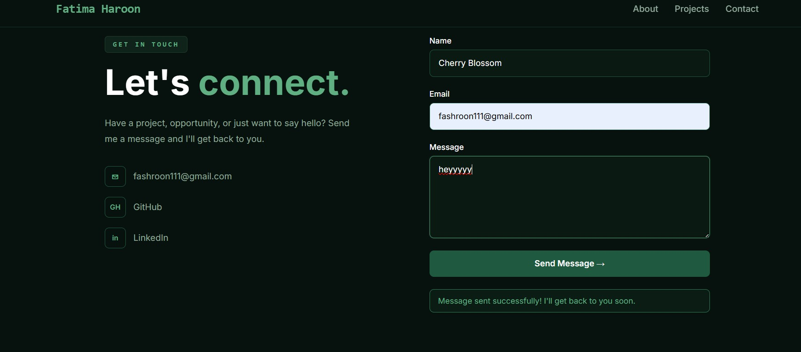
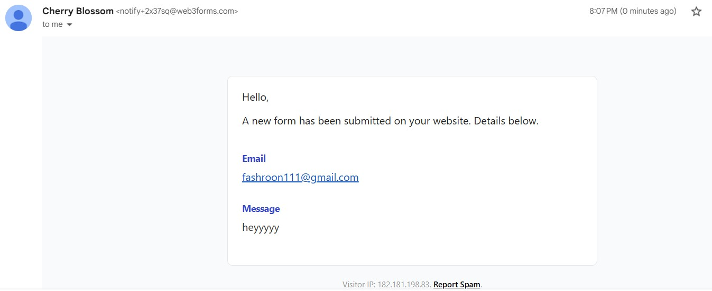

### How My Contact Form Works

My portfolio has one dynamic feature: a working contact form.

A backend is the part of a website that works behind the scenes. The user normally does not see it. It receives information from the frontend, processes it, and can send that information to another service.

When someone fills out my contact form, they enter their name, email address, and message. The frontend collects this information and sends it to the service handling my form submission. The service processes the submission and sends the message to my email.

The basic data flow is:

**Visitor → Contact Form → Form Service/Backend → My Email**

This makes the contact form different from a normal static section of my portfolio. The form is actually sending data somewhere and producing a real result.

I tested the feature using a real submission, and the message successfully reached my email. The feature is deployed on the free tier and works on the live version of my portfolio.

